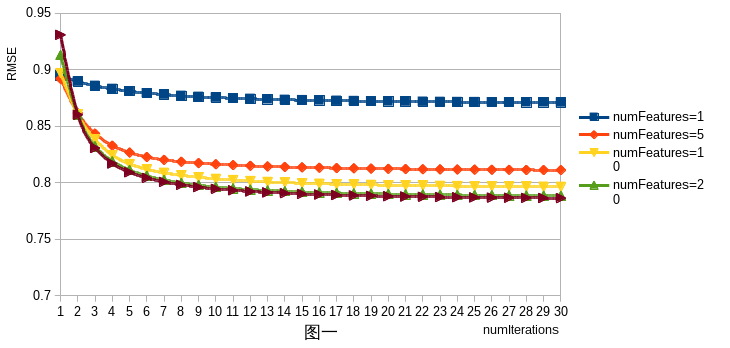
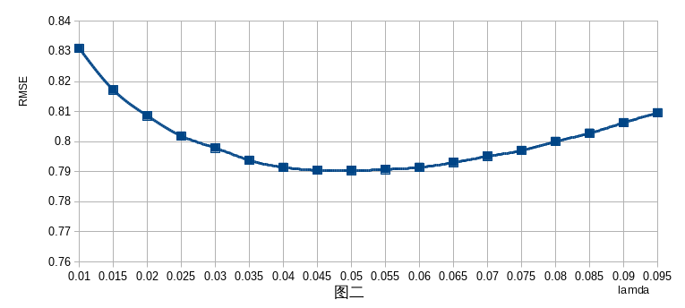
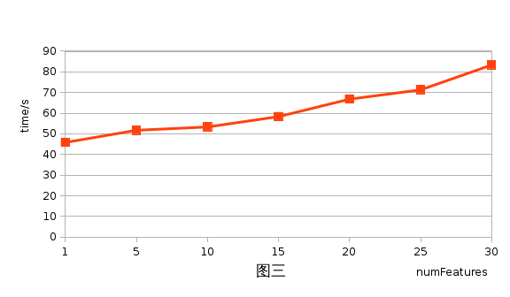
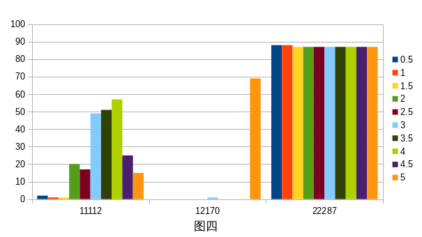

# 基于 Hadoop Map-Reduce 的推荐系统

## 一、设计思路

数据集中涉及了71567位用户，10681部电影，而评分数据只有10000054条，近99%的评分是未知的。该问题即为矩阵填补问题，已知矩阵的少部分元素，预测其他未知元素的值。假设每个用户和电影都可以用若干个因子来刻画，表达式为

        R ~= U Mᵀ

其中R(users x items)为评分矩阵，U(users x features)与M(items x features)分别为用户与电影的因子矩阵。
我们选择基于ALS(交替最小二乘法)的协同过滤算法在hadoop上进行并行化。

我们希望找到一个低秩矩阵X,来逼近矩阵R,同时最小化下面的损失函数。

        ℒ(X) = ∑ᵢⱼ(Rᵢⱼ-Xᵢⱼ)²                                (1)

考虑矩阵分解,X = U MT,式(1)可以改写为

        ℒ(U,M) = ∑ᵢⱼ(Rᵢⱼ-UᵢMᵀⱼ)²                            (2)

为了防止过拟合,给式(2)加上正则化项,则式(2)可改写为

        ℒ(U,M) = ∑ᵢⱼ(Rᵢⱼ-UᵢMᵀⱼ)²+λ( ॥ Uᵢ॥ ²+ ॥ Mᵀⱼ॥ ²)      (3)
        
固定M,对U求导

        ∂L(U,M)/∂U = 0
        
得到下面求解U的公式

        Uᵢ = Aᵢ⁻¹ Vᵢ                                        (4)
        Aᵢ = MᵢMᵢᵀ + λnE, Vᵢ = MᵢRᵀ
        
同理,可以得到求解M的公式

        Mⱼ = Aⱼ⁻¹ Vⱼ                                        (5)
        Aⱼ = UⱼUⱼᵀ + λnE, Vⱼ = UⱼR

## 二、实现方案

### 第一步 数据预处理

数据集是由一条一条用户的评分记录组成的，每条数据均为“用户::电影::得分::时间”的格式，表示某一个用户对某一个电影进行打分。我们对数据集进行处理后得到格式为"用户,电影,得分"的文件cleanRatings，同时分析用户评分的分布特征，过滤出恶意用户。
输入数据与输出数据的格式如下：

        输入ratings:          用户::电影::得分::时间
        输出cleanRatings:     用户,电影,得分
        
### 第二步 创建用户评分矩阵

为了方便迭代时用户评分的读取，对同一用户的评分记录进行聚集。

        输入cleanRatings:     用户,电影,得分
        输出userRatings:      用户  电影1,得分1:电影2,得分2:电影3,得分3
        
这个过程可以用Hadoop的Map-Reduce实现，文件输入方式使用默认的文本输入，每次读入一条数据。Map函数接受数据并转换成key/value(用户/电影,评分)列表，Reduce函数接受Map函数生成的列表，根据key对相同的用户进行整合，不同电影的评分用':'连接。输出文件userRatings。

### 第三步 创建电影评分矩阵

        输入Ratings:          用户,电影,得分
        输出itemRatings:      电影  用户1,得分1:用户2,得分2:用户3,得分3

这个过程与第二步相似，只是Map函数生成的列表变为key/value(电影/用户,评分)，Reduce函数对相同的电影进行整合，输出itemRatings。

### 第四步 初始化M矩阵

        输入itemRatings:      电影  用户1,得分1:用户2,得分2:用户3,得分3
        输出M-0:              电影  平均分，随机数1，随机数2，随机数3……
        
初始化M矩阵需要使用到电影的平均分，Map函数读取对某部电影进行评分的所有评分，计算出平均分，输出key/value(电影/平均分)对。

Reduce函数需要一个参数numFeatures，代表因子矩阵的因子个数。Reduce函数对Map函数输出的每一条记录的平均数后添加(numFeatures-1)个随机数，随机数的取值范围为0到1之间。为方便迭代时文件读入，将Reducer的个数设置为1，输出文件为M-0。

### 第五步 迭代更新U和M

该步骤是一个迭代的过程，每次迭代需要调用两次Map-Ruduce，迭代过程如下：

        for (int currentIteration = 0; currentIteration < numIterations; currentIteration++) {
            broadcast M, read userRatings row-wise, recompute U row-wise;
            broadcast U, read itemRatings row-wise, recompute M row-wise;
        }
        
ALS算法一次迭代需要分别计算U和M,而求U或求M的过程是比较费时的,这个过程正是算法并行之所在。在计算每一个用户的特征向量U时,与它相关的量只有电影特征向量M和该用户评分过的电影的集合。同理,在计算每一部电影的特征向量M是,与它相关的只有用户的特征向量U和评价过该电影的用户的集合。用户与用户之间,电影与电影之间是没有联系的,所以我们在计算特征向量U和M时,是可以通过并行方式来处理的。

在迭代过程中,每次求U和M都需要启动一次Map-Reduce过程,由于用户和电影ID的唯一性,基于Map-Reduce的ALS算法不需要Reduce过程。

基于Map-Reduce的ALS算法求解U的步骤如下:

1. 在map加载电影特征矩阵M,输入为用户评分数据userRatings
2. 根据式(4),对每个用户计算特征向量,输出U

基于Map-Reduce的ALS算法求解M的步骤如下:

1. 在map加载用户特征矩阵U,输入为电影评分数据itemRatings
2. 根据式(5),对每部电影计算特征向量,输出M

进行多次迭代反复计算U和M,直到迭代次数足够多,退出迭代。为了下一次迭代时输入数据方便,同样将reduce的数目设置为1。

### 第六步 预测评分

计算出用户特征矩阵U和物品特征矩阵M后,我们只需要将两个矩阵相乘即可得到用户的预测评分。该步骤使用Map-Reduce实现。

        输入Testdata:         用户:电影
        输出Prediction:       用户:电影:预测评分
        
在Map过程中,载入已经计算好的电影特征矩阵M和用户特征矩阵U。每次Map函数读取一条数据,分别从电影特征矩阵M和用户特征矩阵U中取出电影和用户的特征向量，特征向量相乘，结果即为预测评分。若该用户为恶意用户，则在第一步被过滤，导致未参与矩阵的分解，所有用户特征矩阵中不存在该用户的特征向量，此时预测评分为该用户所有评分的平均分。

## 三、评估与优化

### 准确性评估

为评估该算法对评分预测的准确性，对所有数据进行十折交叉验证，测量均方根误差(RMSE)和平均绝对误差(MAE)两个指标。

将分成的10块数据中的九份作为训练集train，另外一份作为测试集test。
先对训练集train进行分解因子矩阵得到U和M，再对测试集计算平均误差。

        输入test:             用户,电影,得分
        输出deviation:        RMSE, MAE
        
每个Map先预先读取因子矩阵U和M，Map函数对每条数据的用户和电影计算预测评分，再与真实评分比较，Reduce函数对所有误差计算平均。

### 参数测试

在基于ALS的协同过滤算法中,有一些参数需要我们进行设定,其中包括特征数、迭代次数、正则化项系数。为了获得更好的结果,我们进行了一些测试来探究各个参数对算法性能的影响。

#### 1、准确性测试

我们随机选择数据集的90%作为训练集,剩下的10%作为测试集。先用每一组参数对训练集进行训练,然后用测试集来测量出的RMSE作为评估算法准确性的标准,RMSE越小,预测越准确。

##### 特征数与迭代次数

我们推断，特征值数目与迭代次数越大，算法的准确信越高，相应的计算时间也会延长。为了研究准确性随特征数与迭代次数变化的趋势，我们选取固定的正则化项系数λ=0.065，特征数与迭代次数作为变量进行测试，结果如图一所示，横坐标表示迭代迭代次数,纵坐标表示测量得出的RMSE,不同的曲线具有不同的特征值。

由图很明显可以看出:

1. 当特征值数目较小(小于10)时,特征值数目的增加可以很快提高预测的准确性,当特征值数目较大(20以上)时,对预测的准确性影响已经很小
2. 当迭代次数较小(小于10)时,每一次迭代都可以极大地提高预测的准确性,当迭代次数较大时,多进行一轮迭代并不会对准确性的提升有很大的帮助

##### 正则化项系数

正则化项系数λ与模型能否拟合数据有重要的影响。当λ过小时，模型会出现过拟合的情况，同样，当λ过大时，模型会欠拟合。为了选取一个合适的λ作为参数，我们选取固定的特征数numFeatures=20，迭代次数numnumIterations=15，以λ为变量进行测试，得出了下面的折线图，横坐标为λ，纵坐标为RMSE。

由图二可以看出，对特征数numFeatures=20，迭代次数numnumIterations=15这样的参数组合，λ=0.05是比较合适的选择。

#### 2、时间测试

由算法原理可以发现,算法的运行时间与特征数和迭代次数相关，随迭代次数线性增长的,每轮迭代所花费的时间大致相当。现在我们测量在相同的硬件条件下,对不同的特征值数每一轮迭代所花费的时间,结果如图三所示,横坐标表示特征值数,纵坐标表示每一轮迭代所需的时间。为减小硬件状态等偶然因素的影响,对各个特征值数统一进行了30轮迭代,最后求平均得出需要的时间。

由图三可以看出,当特征值数不是非常大(小于30)时,每一轮迭代时间随着特征值数线性增长,增长幅度不是很大。

#### 3、参数选择

经过测试特征值数与迭代次数对预测准确性和运行时间影响,我们综合考虑程序的性能,选择

        特征值数        numFeatures = 20
        迭代次数        numnumIterations = 15
        正则化项系数     λ = 0.05

作为最终运行程序的参数。

### 恶意用户

数据集中存在恶意用户。恶意用户的表现分为两类：

1. 评分单一化，即大量打同一评分
2. 评分随机化，即各种评分所占比例均等

为了辨别出恶意用户，我们分析用户的评分分布规律。

图四是三位用户的评分分布统计图，横坐标是用户的编号，纵坐标是各用户评分的频数。图中编号为11112的用户表现为正常用户，编号为12170的用户大量打5分的评分，其他评分大多为0,表现为第一类恶意用户，评分单一化，编号为22287的用户所有评分都打了近似相同的次数，表现为第二类恶意用户，评分随机化。

为了从数学角度区分三类用户，我们定义

        ident = n/m
        
其中n为该用户所有评分中最大频数，m为该用户的评分总数。

1. 当ident大于一个上界(逼近1)时，则该用户表现为评分单一化，即第一类恶意用户
2. 当ident小于一个下界(逼近1/10)时，则该用户表现为评分随机化，即第二类恶意用户

通过多次调整上界和下界的取值观察辨别结果，我们发现上界取0.95，下界取0.15时会有相对较好的分辨结果。
图四中三位用户的ident计算结果如下：

        ident(11112) = 51/238 = 0.2142857142857142
        ident(12170) = 69/70  = 0.9857142857142858 > 0.95，恶意用户
        ident(22287) = 88/872 = 0.1009174311926605 < 0.15，恶意用户
        
三位用户的都能被正确辨别。

当恶意用户在数据预处理过程中被辨别出以后，会被单独写入一个文件，该文件记录了所有的恶意用户及其所有评分的平均分，其他用户进行接下来的矩阵分解迭代过程。最终进行评分预测时，先判断该用户是否是恶意用户，若是则从恶意用户名单中读取该用户评分的平均分作为预测评分，若不是则提取用户特征向量和电影特征向量计算评分。

### 稀疏性

为了观察数据稀疏性对预测结果的影响，我们分别计算了稀疏度在1.3%、1.1%和0.9%时的RMSE，结果如下：

        1.3%    0.7913639736424998
        1.1%    0.7993476439279736
        0.9%    0.8081189817991191

由结果可见当数据更稀疏时，RMSE会有略微上浮。

## 四、测试结果

确定了运行程序的参数,我们对所有数据进行十折交叉验证,分别计算均方根误差(RMSE)与平均绝对误差(MAE),结果如下表:

<table cellpadding="5" style="margin:auto;border-style:solid;border-width:1px">
    <tr>
        <th></th>
        <th>RMSE</th>
        <th>MAE</th>
    </tr>
    <tr>
        <th>第一次</th>
        <td>0.7900865082</td>
        <td>0.6113587951</td>
    </tr>
    <tr>
        <th>第二次</th>
        <td>0.7903126609</td>
        <td>0.6114403029</td>
    </tr>
    <tr>
        <th>第三次</th>
        <td>0.7908833371</td>
        <td>0.6118437295</td>
    </tr>
    <tr>
        <th>第四次</th>
        <td>0.7890070589</td>
        <td>0.6103365663</td>
    </tr>
    <tr>
        <th>第五次</th>
        <td>0.7884791796</td>
        <td>0.6097068645</td>
    </tr>
    <tr>
        <th>第六次</th>
        <td>0.7901704906</td>
        <td>0.6111154086</td>
    </tr>
    <tr>
        <th>第七次</th>
        <td>0.7895555753</td>
        <td>0.6107386314</td>
    </tr>
    <tr>
        <th>第八次</th>
        <td>0.7905269635</td>
        <td>0.6112669251</td>
    </tr>
    <tr>
        <th>第九次</th>
        <td>0.7895956606</td>
        <td>0.6109347916</td>
    </tr>
    <tr>
        <th>第十次</th>
        <td>0.7910274875</td>
        <td>0.6119291222</td>
    </tr>
    <tr>
        <th>平均值</th>
        <td>0.7899644922</td>
        <td>0.6110671137</td>
    </tr>
</table>